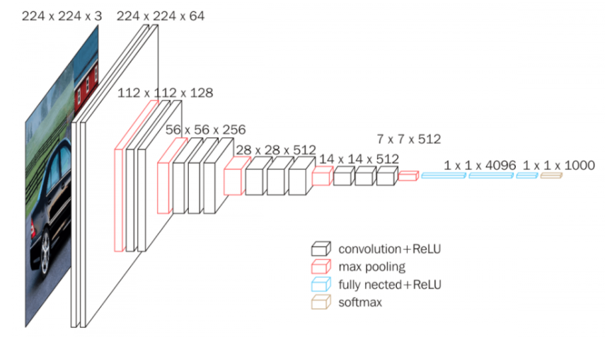
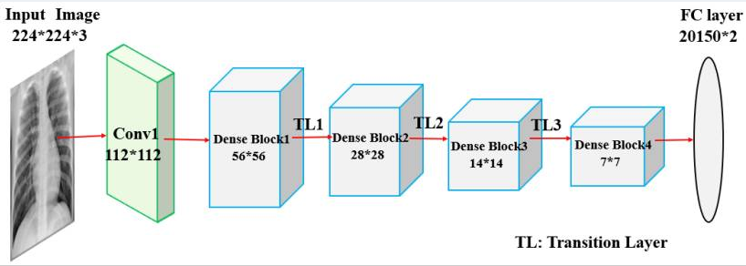

# Title of the Project 
**Authors**: [Tim Hintz](mailto:tjhintz@gmail.com), [Nick
Subic](mailto:bagnine@gmail.com)


## Overview

## Business Problem

As health systems across the United States have become overwhelmed in the past year, the need to streamline and triage medical examinations has become more apparent than ever. Pneumonia remains one of the most frequent causes of death, and diagnosing it quickly can determine whether treatment is successful.

In order to expedite identifying diagnosable signs of pneumonia, we are developing a model which can accurately examine a radiograph for likely areas of lung congestion. Though our model does not offer the in-depth analysis that a radiographer can use in assessing the overall health of a patient or identifying non-pneumonia related health issues, it can quickly assess the presence of bacterial or viral pneumonia from a chest x-ray. 

We hope that this implementation can lead to quicker diagnosis as well as a reduced burden on medical staff as they work to give the best possible treatment to growing numbers of patients. 

## Data

Our dataset contains 5,863 X-Ray images, downloaded from Kaggle. The images were taken from pediatric patients from 1 to 5 years old in Guangzhou, China and contain instances of both bacterial and viral pneumonia.

The set is split into three groups-
1. A training set consisting of 5216 images, 3875 with pneumonia and 1341 healthy
2. A test set consisting of 624 images, 390 with pneumonia and 234 healthy
3. A validation set consisting of 16 images, with 8 each with pneumonia and healthy

## Methodology

For preprocessing, we resized each image to 224x224 pixels and ran models both after converting them to greyscale and as a 3d tensor array.  We calculated the inverse frequency of each class in our training data to use as class weights in our models. 

We created a convoluted neural network consisting of 8 alternating convolution and max pooling layers, followed by a flattening layer and 3 densely connected layers interspersed with regularization layers. Using our target metric- Recall- along with Accuracy and AUC we were able to tune our model to avoid over predicting pneumonia while still avoiding a potentially life-threatening false negative. 






For further analysis, we looked at (insert conclusions about false positives, false negatives here- this needs more in depth analysis)


## Results

## Discussion and Conclusions

## Repository Structure

```
├── Index.ipynb
├── README.md
├── images
├── notebooks
│   ├── EDA
│   └── modelling
└── src
    ├── data
    └── modules
```
